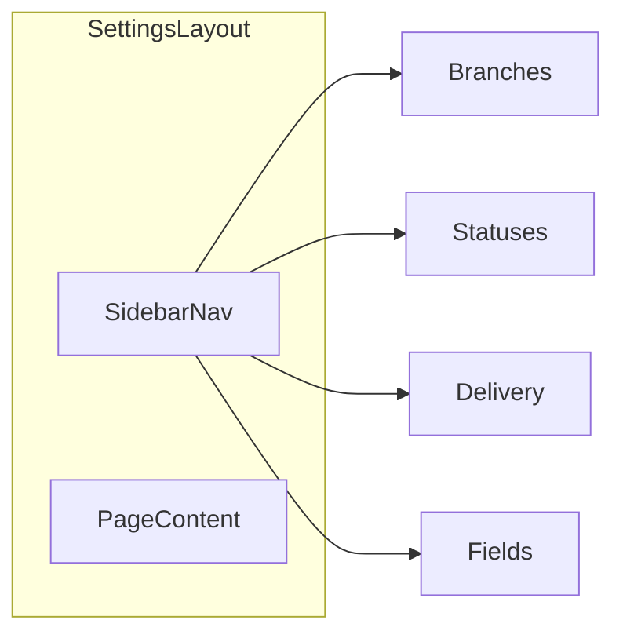

# Chapter 2 — Build Checklist

This document tracks **Chapter 2** work: a unified **Settings** experience for lookup CRUD and record fields, plus an improved **record detail** page with a per-record activity timeline. It complements [`build-checklist.md`](build-checklist.md) (Phases 1–8).

---

## Scope

- **Manager-only** features under `/settings` and record detail at `/records/[id]`.
- **Settings**: floating / card-style **sidebar navigation** with sections for branches, statuses, delivery methods, and record fields; each section shows a **paginated table** (no list filters), **Add** and row **Edit** / **Delete** (no separate View action—all data visible in the table).
- **Record detail**: roughly **3/4 width** for structured **key : value** content on the left; **1/4 width** on the right for a **Google Docs–style** activity timeline (short lines, chronological).

> **Note:** A “floating sidebar” means a **card-style / elevated** navigation rail beside the main settings content—not a separate product or acronym.

### Chapter 2 done when

- [ ] Managers can maintain branches, statuses, and delivery methods from Settings with modals and pagination.
- [ ] Record fields live in the same Settings shell and styling as lookups.
- [ ] Record detail presents data clearly on the left and shows record-scoped audit activity on the right.

---

## Phase A — Settings layout and navigation

- [x] Add a shared **`layout.tsx`** under `app/(app)/(manager)/settings/` wrapping all settings sub-routes.
- [x] Implement a **left navigation rail** (floating / elevated panel: border, shadow, rounded corners) with links to:
  - [x] Branches
  - [x] Statuses
  - [x] Delivery methods
  - [x] Record fields
- [x] Highlight **active** nav item from current pathname.
- [x] Replace or slim **`settings/page.tsx`**: redirect to a default section (e.g. branches) or a minimal hub that matches the new shell.
- [x] Define stable routes (e.g. `/settings/branches`, `/settings/statuses`, `/settings/delivery-methods`, `/settings/fields`); keep **`/settings/fields`** working or add redirects for old URLs.
- [x] Responsive behavior: sidebar collapses or stacks appropriately on small screens.

---

## Phase B — Branches CRUD

- [x] **Server actions** (new or extended `services/` module): paginated list, create, update, delete or **deactivate** for `branches` (`id`, `name`, `is_active`, timestamps).
- [x] **List page** at `/settings/branches`: table with columns such as name, active, updated; **no View** column.
- [x] **Add** and **Edit** via **modal** (Dialog); validate input server-side.
- [x] **Delete** with confirmation; if any `records` reference the branch, **block hard delete** and allow **deactivate** only (or document chosen rule).
- [x] **Server-side pagination** (offset/limit); **no** search/filter on the list (per spec).
- [x] Empty state when there are no branches.

---

## Phase C — Statuses CRUD

- [x] **Server actions** for `statuses`: `code` (unique), `name`, `sort_order`, `is_active`.
- [x] **List page** with paginated table; Add / Edit in modals; Delete/deactivate with confirm.
- [x] Enforce **unique `code`** on create/update.
- [x] Before hard delete, check **FK** usage from `records.status_id`; prefer deactivate when in use.
- [x] No list filters; pagination only.

---

## Phase D — Delivery methods CRUD

- [x] **Server actions** for `delivery_methods`: `code`, `name`, `sort_order`, `is_active`, timestamps.
- [x] Same UX pattern as Phase B/C: table, modals, pagination, no filters, no View column.
- [x] Unique `code` validation; FK safety for `records.delivery_method_id`.

---

## Phase E — Record fields in the new shell

- [ ] Mount existing **Record fields** UI (`FieldSettingsClient` + `services/field-definitions` actions) inside the **same** settings layout as Phases B–D.
- [ ] Align **table**, **modals**, **typography**, and **spacing** with lookup pages.
- [ ] **Pagination** for the field definitions table if the list can grow large; otherwise document a single-page table with a note in this checklist when closed.
- [ ] Preserve existing behaviors: toggles, custom field create/delete, seed-compatible system rows.

---

## Phase F — Record detail: two-column layout and timeline

- [ ] Refactor **`app/(app)/records/[id]/page.tsx`** to a **two-column** layout:
  - [ ] **Desktop**: ~**75% / 25%** split (grid or flex); **mobile**: stack with **main content first**, timeline below.
- [ ] **Left column**: polished **key : value** layout for all visible fields (core, lookups, optional system fields, custom fields); optional **section** groupings (e.g. Intake, Customer, Additional).
- [ ] **Right column**: **activity timeline** styled like a compact revision history (vertical line, dots, relative or short timestamps).
- [ ] Query **`activity_logs`** where `entity_type = 'record'` and `entity_id` matches the record id; order by `created_at` descending (newest first or reverse for “story” order—pick one and keep consistent).
- [ ] Join **actor** display name when `actor_user_id` is present.
- [ ] Map **`event_type`** values to short, human-readable labels (e.g. record create/update/archive/restore).
- [ ] **Empty state** when no audit rows exist for this record (explain that only logged events appear).
- [ ] Optional: **Suspense** / skeleton for the timeline segment.

**Note:** Events that never set `entity_id` will not appear in this sidebar—coverage is **best-effort** based on existing audit logging.

---

## Phase G — QA and handover

- [ ] Confirm **manager-only** access on new settings routes (reuse `requireManager` / manager layout).
- [ ] Smoke-test: create/edit/deactivate lookup rows; create record using new data; open record detail and verify timeline.
- [ ] Optional follow-up: add or extend **Vitest** / **Playwright** cases for new settings routes and record detail (not blocking Chapter 2 doc completion).

---

## Reference diagram

---

## Implementation notes (for developers)

- **Deactivate vs delete**: Prefer **`is_active = false`** when the lookup row is still referenced by `records`; allow hard delete only when safe.
- **Styling**: Reuse existing shadcn components (`Dialog`, `Table`, `Button`) and project tokens for a consistent **simple** UI.
