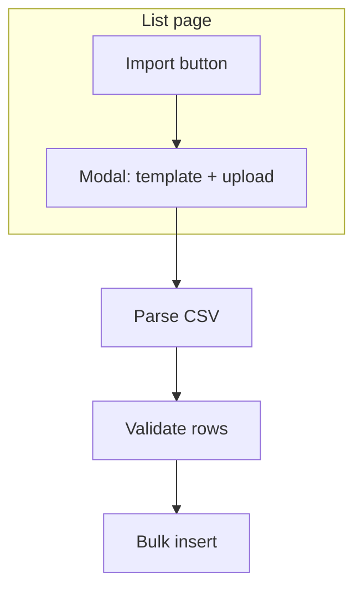

# Chapter 3 — Build Checklist (CSV bulk import)

This document tracks **Chapter 3** work: **bulk import from CSV** for lookup tables (branches, statuses, delivery methods) and for **records** (legacy migration path). It complements [`build-checklist.md`](build-checklist.md) and [`build-checklist-chapter-2.md`](build-checklist-chapter-2.md).

---

## Scope

- **List pages** gain an **Import** control (button + icon) that opens a **modal** (or equivalent dialog).
- Inside the modal: **download a sample CSV template**, **upload a populated CSV**, **validate**, then **bulk insert** (server-side).
- **Lookups** (branches, statuses, delivery methods): columns align with existing schema and validation rules (unique codes where applicable, etc.).
- **Records import** is explicitly **legacy**: not every column is required in the CSV. Where the app would normally require a value but the cell is empty, apply a **deterministic placeholder** (e.g. serial number → `legacy-import-<row>` or `legacy-s/n` pattern—pick one convention and document it in code comments). Resolve foreign keys (branch, status, delivery method) by **stable id** or by **code/name** as specified per phase—document the chosen mapping in this checklist when implemented.

### Chapter 3 done when

- [x] Managers can import CSVs for **branches**, **statuses**, and **delivery methods** from the respective Settings list pages with template download + upload + bulk insert.
- [x] **Managers** can import **records** from the **Records** list page with template download + upload + bulk insert, using the legacy placeholder rules for missing required fields (v1).
- [ ] Failed rows are reported clearly (row numbers, reasons); successful rows commit in a predictable way (see Phase F).

---

## Cross-cutting UX and behavior

- [x] **Import** button with icon on each target list page (branches, statuses, delivery methods, records).
- [x] **Modal** (Dialog): short title; optional one-line description kept concise per project copy style.
- [x] **Download sample CSV** (static template or route handler that returns `text/csv` with header row + example row(s)).
- [x] **File input** for `.csv` (and reject non-CSV with a clear message).
- [x] **Parsing**: robust handling of UTF-8, quoted fields, commas in values (use a vetted CSV parser or well-tested split rules—document choice). **Implementation:** [papaparse](https://www.papaparse.com/) via `lib/parse-csv.ts` (Phase B+).
- [ ] **Validation**: row-level errors; block or partial-apply policy chosen in Phase F.
- [ ] **Permissions**:
  - [x] **Settings lookups**: **manager-only** (same as existing settings routes).
  - [x] **Records**: **manager-only** for v1 (`import-records-csv`); specialists do not import via CSV.
- [ ] **Audit**: optional `writeAuditLog` events for bulk import (event type to define, e.g. `record_bulk_import`)—note in implementation notes when closed.
- [ ] **Performance**: cap file size / max rows per request; document limits in UI or docs.

---

## Phase A — Shared import UI primitives

- [x] Reusable **Import dialog** shell (props: title, template download handler, upload submit, children for format hints).
- [x] **Download template** helper (shared across pages or small wrappers per entity).
- [x] **Client → server** submission via **Server Action** or **Route Handler** (`multipart/form-data` or text upload); prefer one pattern for all four importers.
- [x] **Error / success** feedback (toast or inline summary) consistent with existing app patterns.

---

## Phase B — Branches CSV import

- [x] **Template columns** (suggested): `name`, `is_active` (optional, default true); `id` optional if importing fixed ids—if omitted, generate UUIDs server-side.
- [x] **Server action** (or service): parse CSV → validate → `insert` / `on conflict` policy (insert-only vs upsert by id—**decide**).
- [x] **Revalidate** `/settings/branches`, `/records`, `/records/new` after success.
- [x] **Empty / duplicate** handling documented (skip duplicates by name?—**decide**).

**Decisions (v1):** Optional `id`: existing id → update `name` / `is_active`; new id → insert. No `id` → insert with random UUID only if that name (case-insensitive) is not already in the DB. Duplicate name in the same file (case-insensitive) → later rows skipped. Empty `name` row → skipped. See `services/import-branches-csv.ts`.

---

## Phase C — Statuses CSV import

- [x] **Template columns** (suggested): `code`, `name`, `sort_order`, `is_active`.
- [x] Enforce **unique `code`** (reject row or skip with error).
- [x] **Revalidate** `/settings/statuses` and record routes as needed.

**Decisions (v1):** Same pattern as branches: optional `id` (UUID) for update or insert with fixed id. Natural key is **`code`** (unique in DB). Duplicate `code` in the file or `code` already taken by another row → **skipped**. Invalid `code` format / missing name / bad `sort_order` → **failed import** (transaction rolled back). See `services/import-statuses-csv.ts`.

---

## Phase D — Delivery methods CSV import

- [x] **Template columns** (suggested): `code`, `name`, `sort_order`, `is_active`.
- [x] Enforce **unique `code`**.
- [x] **Revalidate** `/settings/delivery-methods` and record routes as needed.

**Decisions (v1):** Same as statuses (Phase C): optional `id`, natural key `code`, shared `parseCodeField` in `lib/import-csv-parse.ts`. See `services/import-delivery-methods-csv.ts`.

---

## Phase E — Records CSV import (legacy)

- [x] **Template columns** cover core fields: e.g. `record_no` (or auto-generate if empty—**decide**), `date_received`, `date_returned`, `branch_id` or branch key column, `pc_model`, `serial_number`, `tag_number`, `maintenance_note`, `customer_name`, `phone_number`, `status_id` or status key, `delivery_method_id` or delivery key, optional custom columns → `custom_data` JSON mapping—**finalize column list** when implementing.
- [x] **Legacy rule**: if a **required** DB field is missing/blank in CSV, set a **placeholder** (e.g. `serial_number` → `legacy-import-<rowIndex>` or `legacy-s/n-<rowIndex>`; same idea for other required strings—**must be unique** where the schema requires uniqueness, e.g. `record_no`, `serial_number` if deduped).
- [x] **Lookup resolution**: map branch/status/delivery by **id** (preferred for stability) and/or by **code**—document in README snippet when done.
- [x] **created_by / updated_by**: set to **importing user** (session).
- [x] **Soft-delete**: imported rows **not** deleted (`deleted_at` null unless column supported later).
- [x] **Optional**: append-only audit log entry per batch with row count.

**Decisions (v1):** `requireManager()`. **branch_id:** branch id or **branch name** (case-insensitive). **status_id:** status id or **status code**. **delivery_method_id:** id or **delivery code**. Active lookups only. Placeholders: empty `record_no` → `generateNextRecordNo` (transaction-aware); empty `date_received` → today (UTC); empty `serial_number` → `legacy-sn-<row>-<suffix>`; empty `customer_name` → `Legacy import`; empty `phone_number` → `n/a`; empty `pc_model` → `Unknown`. Required custom fields → `"legacy-import"` in `custom_data`. **Audit:** `record_bulk_import` with `rowsImported`. See `services/import-records-csv.ts`.

---

## Phase F — Transactions, partial success, and reporting

- [ ] **Strategy**: all-or-nothing transaction vs **per-row** with summary (success count, failure count, downloadable error CSV)—**pick one** for v1 (recommend: **per-row** with summary for large legacy files).
- [ ] **Idempotency** (optional): detect duplicate `record_no` / serial and skip or fail row—**decide**.

---

## Phase G — QA and handover

- [ ] Unit tests for CSV parsing edge cases (quotes, newlines in fields).
- [ ] Manual smoke: download template → fill minimal rows → import → verify DB rows and list UI.
- [ ] Document **max rows** and **file size** limits in [`docs/DEPLOYMENT.md`](DEPLOYMENT.md) or `README` if relevant.

---

## Implementation notes (for developers)

- **CSV library**: **papaparse** (`lib/parse-csv.ts`) — prefer over hand-rolled split; add dependency deliberately.
- **Security**: never execute CSV as code; validate types and length; scan for absurdly large payloads.
- **Neon / serverless**: batch inserts in chunks to avoid statement timeouts on huge files.
- **Placeholder strings** for legacy imports must remain **unique** where the schema requires uniqueness (`record_no`, `serial_number` uniqueness rules—check `services/records` and migrations).

---

## Reference diagram

